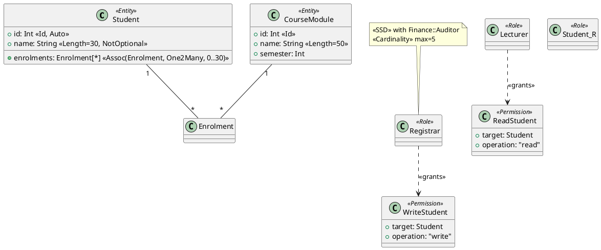

# Technical Report

## Tích hợp RBAC cross‑domain vào kiến trúc microservice NestJS theo cách tiếp cận concern‑driven: pipeline biến đổi và bộ sinh mã dựa trên template Handlebars

**Tác giả:** [Học viên]
**Người hướng dẫn:** [GVHD]
**Phiên bản:** Draft v0.1
**Trạng thái:** Báo cáo định hướng kỹ thuật cho luận văn thạc sĩ

---

## Mục lục

1. Tóm tắt
2. Bối cảnh và định vị
3. Tổng quan pipeline
4. Giai đoạn 1 — Đầu vào: PlantUML/Mermaid + OCL
5. Giai đoạn 2 — Parsing và xây dựng Unified Model (AST)
6. Giai đoạn 3 — Compose concern (Structure / Behavior / RBAC cross‑domain)
7. Giai đoạn 4 — Kiểm chứng OCL bằng USE / Eclipse OCL
8. Giai đoạn 5 — Bộ sinh mã TypeScript dựa trên Handlebars
9. Giai đoạn 6 — Kiến trúc runtime NestJS
10. RBAC cross‑domain trên multitree TMSA
11. Case study: CourseMan đa miền
12. Kế hoạch đánh giá
13. Rủi ro và biện pháp giảm thiểu
14. Lộ trình thực hiện
15. Phụ lục: tổ chức repo, ví dụ template

---

## 1. Tóm tắt

Báo cáo này trình bày phương hướng kỹ thuật cho luận văn thạc sĩ với mục tiêu: (i) đặc tả Role‑Based Access Control (RBAC) cross‑domain dưới dạng một concern hạng nhất trong Domain‑Driven Design (DDD) theo trường phái annotation‑based DSL của nhóm VNU‑UET (DCSL, AGL, UDML, TMSA); (ii) lấy đầu vào là sơ đồ UML dưới dạng văn bản (PlantUML là chính, Mermaid là tùy chọn) kèm đặc tả ràng buộc OCL đầy đủ; (iii) kiểm chứng mô hình ở thiết kế bằng công cụ OCL hiện hữu (USE / Eclipse OCL); và (iv) sinh ra phần mềm thực thi trên nền NestJS thông qua một bộ sinh viết bằng TypeScript, sử dụng template Handlebars (`.hbs`) làm cơ chế sinh.

Đóng góp chính:

- **RBAC‑aDSL cross‑domain** với metamodel mở rộng UDML, cú pháp cụ thể là tập decorator NestJS (`@Role`, `@Permission`, `@RequiresRole`, `@SSD`, `@DSD`, `@RoleMapping`…), và ngữ nghĩa OCL đầy đủ bao gồm cả ràng buộc liên miền (no privilege escalation, SSD/DSD xuyên miền, role‑mapping acyclic).
- **Pipeline biến đổi `Diagram → AST → Verified Model → Code`**, trong đó AST là Unified Domain Model (UDM) hợp nhất ba concern.
- **Bộ sinh mã `udm‑gen` bằng TypeScript trên nền ts‑morph + Handlebars**, sinh ra đầy đủ entity TypeORM, controller, service, DTO, guard, decorator, module ánh xạ role giữa các bounded context, và cấu hình Nest gateway.
- **Case study CourseMan đa miền** (Academic vs Finance) cùng bộ tiêu chí đánh giá: feasibility, productivity, understandability, đúng đắn thực thi, mô‑đun/trực giao, và truy vết model↔code.

---

## 2. Bối cảnh và định vị

### 2.1 Định vị trong mạch nghiên cứu

Các bài báo tham khảo tạo thành bốn tầng:

| Tầng | Bài báo | Vai trò trong đề tài |
|---|---|---|
| Nền tảng RBAC | Sandhu et al. (1996); Ray, Li, France (2004) | Mô hình tham chiếu RBAC₀–RBAC₃; UML template + OCL + violation pattern |
| Annotation‑based DSL cho DDD | DCSL (2018/2020); AGL (2023); AGL Pattern (KSE 2023) | Khuôn mẫu cấu trúc/hành vi; biến đổi UML → đặc tả → mã (Acceleo) |
| Hợp nhất concern | UDML (2025) | Cơ chế compose AST, tính trực giao và truy vết |
| Kiến trúc đích | TMSA (Information & Software Technology 2025) | Multitree microservice, TASL, resiliency patterns |

Khoảng trống đề tài lấp: UDML đã liệt kê RBAC như một concern khả thi nhưng chưa đặc tả thành aDSL ngang hàng DCSL/AGL; TMSA chưa coi access control là concern compose được; mạch RBAC cross‑domain (Li et al. 2022 trong tham chiếu [21] của UDML) chưa kết hợp với generator chính thống.

### 2.2 Quyết định kỹ thuật đã chốt

- **Ngôn ngữ đích:** TypeScript / NestJS (thay vì Java/jDomainApp như nguyên bản nhóm). Lý do: decorator của TypeScript là tương đương trực tiếp của annotation Java, nên tinh thần aDSL được bảo toàn; đồng thời mở rộng hệ sinh thái nhóm sang stack Node hiện đang phổ biến trong công nghiệp.
- **Đầu vào:** PlantUML (chính) + Mermaid (tùy chọn) cho phần sơ đồ; OCL đầy đủ cho phần ràng buộc, đặt trong file đồng hành `.ocl` hoặc note trong PlantUML.
- **Ngữ nghĩa hình thức:** OCL đầy đủ, kiểm chứng bằng USE hoặc Eclipse OCL ở mức thiết kế.
- **Phạm vi RBAC:** đa miền (cross‑domain), bao gồm role mapping liên miền, SSD/DSD xuyên miền, chống leo thang đặc quyền.
- **Cơ chế sinh mã:** template Handlebars (`.hbs`), kết hợp ts‑morph khi cần thao tác AST TypeScript phức tạp (chèn decorator, merge import, v.v.).

---

## 3. Tổng quan pipeline

```
┌──────────────────────────────────────────────────────────────────────────────┐
│                              INPUT LAYER                                     │
│                                                                              │
│   PlantUML (.puml)        Mermaid (.mmd)        OCL (.ocl)                   │
│   - class diagram         - classDiagram        - WF invariants              │
│   - stereotypes <<Role>>  - relations           - SSD/DSD/cardinality        │
│   - note OCL hint                               - cross-domain inv           │
└────────────┬────────────────────┬─────────────────────┬─────────────────────┘
             │                    │                     │
             ▼                    ▼                     ▼
       ┌──────────────────────────────────────────────────────────────┐
       │   STAGE 1 — PARSE                                            │
       │   plantuml-parser / mermaid-parser / ocl-parser              │
       │   → AST trung gian từng nguồn                                │
       └────────────────────────────┬─────────────────────────────────┘
                                    ▼
       ┌──────────────────────────────────────────────────────────────┐
       │   STAGE 2 — UNIFY (build UDM)                                │
       │   - Tạo Unified Domain Model AST                             │
       │   - 3 concern: Structure(DCSL), Behavior(AGL), RBAC          │
       │   - Annotable / Annotation theo cơ chế của UDML              │
       └────────────────────────────┬─────────────────────────────────┘
                                    ▼
       ┌──────────────────────────────────────────────────────────────┐
       │   STAGE 3 — COMPOSE                                          │
       │   - Tree-merging AST (thuật toán của UDML)                   │
       │   - Cross-DSL referencing (RBAC ↔ DCSL/AGL elements)         │
       │   - Cross-domain binding (role mapping, federation)          │
       └────────────────────────────┬─────────────────────────────────┘
                                    ▼
       ┌──────────────────────────────────────────────────────────────┐
       │   STAGE 4 — VERIFY (OCL)                                     │
       │   - Export sang USE format hoặc Ecore + OCL                  │
       │   - Chạy invariants: WF + RBAC constraints                   │
       │   - Báo lỗi violation pattern (Ray-Li-France style)          │
       └────────────────────────────┬─────────────────────────────────┘
                                    ▼
       ┌──────────────────────────────────────────────────────────────┐
       │   STAGE 5 — GENERATE (Handlebars + ts-morph)                 │
       │   - Render templates theo UDM AST                            │
       │   - Per-domain: entity, dto, service, controller, guard      │
       │   - Cross-domain: gateway, role-mapper, jwt strategy         │
       │   - Output: monorepo NestJS                                  │
       └────────────────────────────┬─────────────────────────────────┘
                                    ▼
       ┌──────────────────────────────────────────────────────────────┐
       │   STAGE 6 — RUNTIME                                          │
       │   NestJS monorepo: API gateway + N domain services           │
       │   + JWT propagation + RolesGuard + PDP cross-domain          │
       └──────────────────────────────────────────────────────────────┘
```

Pipeline là **một chiều, deterministic, có kiểm chứng ở giữa**. Mỗi giai đoạn có đầu vào/đầu ra rõ ràng và kiểm thử được độc lập — yêu cầu cốt lõi để truy vết model↔code (RQ4).

---

## 4. Giai đoạn 1 — Đầu vào: PlantUML/Mermaid + OCL

### 4.1 Profile PlantUML cho UDM

Định nghĩa một quy ước (profile) ánh xạ cấu trúc UDM lên cú pháp PlantUML:



Quy ước:

| Khái niệm UDM | PlantUML | Ghi chú |
|---|---|---|
| Domain class | `class X <<Entity>>` | tương ứng `@DClass` trong DCSL |
| Domain field | thuộc tính + stereotype | `<<Id>>`, `<<Auto>>`, `<<Length=N>>`, `<<NotOptional>>` |
| Association | đường nối UML + multiplicity | sinh ra `@DAssoc` |
| Role | `class X <<Role>>` | concern RBAC |
| Permission | `class X <<Permission>>` với `target` và `operation` | |
| Grant | `Role ..> Permission : <<grants>>` | quan hệ PA |
| Role hierarchy | `RoleSenior --|> RoleJunior : <<inherits>>` | |
| SSD/DSD | `note` + tham chiếu OCL | chi tiết ở file `.ocl` |
| Cross‑domain | namespace `Domain::Role` | parser tách miền theo prefix |

Lý do chọn PlantUML làm chính: hỗ trợ stereotype, note, namespace; có parser mature; cộng đồng lớn. Mermaid bị hạn chế ở stereotype và namespace, nên chỉ dùng cho diagram nhỏ.

### 4.2 File OCL đồng hành

Vì OCL đầy đủ thường dài, để trong note PlantUML sẽ làm sơ đồ rối. Quy ước: mỗi sơ đồ `X.puml` có một file `X.ocl` đi kèm, ví dụ:

```ocl
-- Academic domain invariants

context Student
  inv UniqueId: Student.allInstances()->isUnique(id)
  inv NameLength: name.size() <= 30

-- RBAC invariants (in-domain)

context SSDRole
  inv NoSharedUser:
    self.r1.User->excludesAll(self.r2.User)

context Role
  inv CardinalityRespected:
    self.User->size() <= self.maxCardinality

-- Cross-domain invariants

context CrossDomainSSD
  inv NoConflictAcrossDomains:
    let allRoles : Set(Role) = self.user.activeRoles()->collect(r |
      r.effectiveRoles())->asSet() in
    self.conflictPairs->forAll(p |
      not (allRoles->includes(p.r1) and allRoles->includes(p.r2)))

context RoleMapping
  inv Acyclic:
    not self.target.transitiveMappings()->includes(self.source)

context RoleMapping
  inv NoPrivilegeEscalation:
    self.target.permissions->forAll(p |
      self.source.allowedTargetPermissions->includes(p))
```

### 4.3 Tinh thần thiết kế đầu vào

Nguyên tắc bám sát mạch nhóm:

- **Diagram = phần trực quan có thể vẽ tay; OCL = phần chính xác hình thức.** Tương tự như AGL Pattern đã tách input thành UML Activity + UML Class + OCL.
- **Stereotype = annotation mức model.** Mỗi stereotype trên PlantUML có một annotation tương ứng trong UDM AST. Đây là điểm cho phép cross‑DSL referencing kiểu UDML.
- **Mermaid hỗ trợ rút gọn**: chỉ dùng khi sơ đồ đơn giản (1 domain, không có hierarchy phức tạp). Hệ thống parse Mermaid sẽ "lift" nó về cùng AST đích.

---

## 5. Giai đoạn 2 — Parsing và xây dựng Unified Model (AST)

### 5.1 Kiến trúc parser

Tổ chức theo pattern *parser front‑end nhiều nguồn → IR thống nhất*:

```
plantuml-parser ──┐
                  ├──► RawSyntaxNode (per source) ──► Lifter ──► UDM AST
mermaid-parser  ──┤                                              ▲
                  │                                              │
ocl-parser ───────┘                                              │
                                                                 │
                  ConstraintLinker ─────────────────────────────┘
```

Các thư viện cụ thể:

- **PlantUML:** dùng `plantuml-parser` (npm) hoặc gọi PlantUML server qua HTTP để lấy AST trung gian dạng JSON, sau đó tự lift sang UDM AST. Nếu cần kiểm soát sâu, viết grammar bằng `chevrotain` (parser combinator TS).
- **Mermaid:** `@mermaid-js/parser` xuất AST native.
- **OCL:** không có parser TS mature, nên dùng `chevrotain` viết một subset OCL đủ cho RBAC (boolean expr, `forAll/exists/includes/excludes`, navigation). Phần đầy đủ để USE/Eclipse OCL xử lý ở Stage 4.

### 5.2 Metamodel UDM (rút gọn)

```ts
// src/udm/types.ts

/** Interface chung cho phần tử có thể bị annotation gắn vào — kế thừa từ UDML */
export interface Annotable {
  id: string;
  kind: 'Class' | 'Field' | 'Method' | 'Parameter' | 'Module' | 'Service';
  annotations: Annotation[];
}

export interface Annotation {
  concern: 'DCSL' | 'AGL' | 'RBAC';
  name: string;                 // ví dụ 'DClass', 'Role', 'RequiresRole'
  props: Record<string, unknown>;
  target: Annotable;            // back‑reference để cross‑DSL referencing
}

// ----- Concern: Structure (DCSL) -----
export interface DomainClass extends Annotable {
  kind: 'Class';
  name: string;
  domain: string;               // bounded context, vd 'Academic'
  fields: DomainField[];
  methods: DomainMethod[];
  mutable: boolean;
}

export interface DomainField extends Annotable {
  kind: 'Field';
  name: string;
  type: TypeRef;
  attr: DAttr;                  // length, optional, id, auto, ...
  assoc?: DAssoc;               // nếu là associative
}

// ----- Concern: RBAC -----
export interface Role extends Annotable {
  kind: 'Class';
  name: string;
  domain: string;
  seniorOf: Role[];             // role hierarchy
  cardinality?: { max?: number; min?: number };
}

export interface Permission extends Annotable {
  kind: 'Class';
  name: string;
  domain: string;
  target: TypeRef;              // tham chiếu Class trong DCSL (cross-DSL)
  operation: 'read' | 'write' | 'create' | 'delete' | 'execute' | string;
}

export interface Grant {
  role: Role;
  permission: Permission;
}

export interface SSDRole {
  domain: string | 'cross';     // 'cross' nếu xuyên miền
  r1: Role;
  r2: Role;
  scope: 'static' | 'dynamic';  // dynamic = DSD
}

export interface RoleMapping {  // cross‑domain
  source: Role;
  target: Role | Permission;
  trustLevel: 'full' | 'limited';
}

// ----- Toàn cảnh -----
export interface UnifiedDomainModel {
  domains: Domain[];
  ssdConstraints: SSDRole[];
  roleMappings: RoleMapping[];
  oclInvariants: OclInvariant[];
}

export interface Domain {
  name: string;
  classes: DomainClass[];
  roles: Role[];
  permissions: Permission[];
  grants: Grant[];
}
```

Lưu ý thiết kế: `Permission.target` tham chiếu thẳng tới `DomainClass` (cross‑DSL referencing) — đây là chỗ cụ thể hóa nguyên tắc UDML về "annotation‑based linking ở mức AST".

### 5.3 Lifter: PlantUML → UDM

Lifter là pure function `(rawAst: PlantUmlAst, oclFile: OclAst, opts) => UnifiedDomainModel`. Pseudocode:

```ts
function lift(raw: PlantUmlAst, ocl: OclAst): UnifiedDomainModel {
  const udm = emptyUdm();
  // 1. duyệt class
  for (const cls of raw.classes) {
    const stereos = cls.stereotypes; // ['Entity'] | ['Role'] | ['Permission']
    if (stereos.includes('Entity'))     liftEntity(cls, udm);
    if (stereos.includes('Role'))       liftRole(cls, udm);
    if (stereos.includes('Permission')) liftPermission(cls, udm);
  }
  // 2. quan hệ
  for (const rel of raw.relations) {
    if (rel.stereotype === 'grants')   liftGrant(rel, udm);
    if (rel.stereotype === 'inherits') liftHierarchy(rel, udm);
  }
  // 3. nhập OCL invariants vào model
  udm.oclInvariants = ocl.invariants;
  // 4. resolve cross-domain references (Domain::Role)
  resolveCrossDomain(udm);
  return udm;
}
```

---

## 6. Giai đoạn 3 — Compose concern

### 6.1 Thuật toán tree‑merging (kế thừa UDML)

UDML định nghĩa cơ chế gắn concern vào core qua `Annotable`/`Annotation`. Ở đây ta hiện thực một biến thể TS:

```ts
function compose(udm: UnifiedDomainModel): UnifiedDomainModel {
  // 1. validate orthogonality: mỗi annotation RBAC phải gắn vào Annotable hợp lệ
  for (const role of allRoles(udm)) {
    assertAnnotableTarget(role); // không gắn role vào Field, v.v.
  }
  // 2. merge: build adjacency model
  buildRoleHierarchyClosure(udm);   // role hierarchy transitive closure
  buildPermissionInheritance(udm);  // permissions inherited theo hierarchy
  // 3. cross-domain linking
  for (const rm of udm.roleMappings) {
    assertSameTrustRealm(rm);
    addInducedPermissions(rm);
  }
  // 4. emit derived elements (CRUD, route handlers...) tương tự DCSL structural mapping
  emitDerivedOperations(udm);
  return udm;
}
```

Ba bất biến cần đảm bảo sau compose (kế thừa từ UDML):

- **Orthogonality:** thêm/bớt concern RBAC không làm hỏng phần Structure/Behavior.
- **Cohesion:** mọi reference cross‑DSL đều resolve được.
- **Traceability:** mỗi annotation RBAC có một `source` chỉ về vị trí trong file `.puml`/`.ocl` (cho thông báo lỗi và truy vết model↔code).

### 6.2 Quan hệ giữa các concern

```
        ┌─────────────────────┐
        │  Structure (DCSL)   │  DomainClass, DomainField, DAssoc
        └──────────┬──────────┘
                   │ Permission.target → DomainClass
                   ▼
        ┌─────────────────────┐
        │     RBAC concern    │  Role, Permission, Grant, SSD, RoleMapping
        └──────────┬──────────┘
                   │ Permission.operation ↔ DomainMethod / module action
                   ▼
        ┌─────────────────────┐
        │   Behavior (AGL)    │  ActivityGraph, Node, Edge (tuỳ chọn)
        └─────────────────────┘
```

Tuỳ chọn: trong phạm vi luận văn có thể *giữ phần Behavior ở mức tối thiểu* (chỉ orchestration cần thiết) để không phình. Cross‑domain RBAC + OCL đầy đủ đã là một khối lớn.

---

## 7. Giai đoạn 4 — Kiểm chứng OCL bằng USE / Eclipse OCL

### 7.1 Vai trò

OCL ở đây đóng hai vai khác nhau, **bắt buộc tách bạch**:

- **Design‑time (giai đoạn 4):** invariants trên metamodel + RBAC, kiểm chứng tĩnh bằng USE.
- **Runtime (giai đoạn 5/6):** một tập con được dịch sang TypeScript và sinh vào guard, validator.

### 7.2 Lựa chọn công cụ

| Tiêu chí | USE (Bremen) | Eclipse OCL |
|---|---|---|
| Mức trưởng thành | Cao, sử dụng rộng trong nghiên cứu | Cao, tích hợp EMF/Ecore |
| Định dạng đầu vào | `.use` (class + invariants) | `.ecore` + `.ocl` |
| Snapshot/animation | Có, hỗ trợ object diagram | Có qua plugin |
| Tích hợp pipeline TS | Gọi qua CLI là khả thi | Tương tự, kèm headless Eclipse |

**Đề xuất:** dùng USE làm chính (CLI dễ tích hợp), Eclipse OCL làm bị kiểm tra chéo cho phần phức tạp.

### 7.3 Bộ exporter UDM → USE

Viết một writer biến `UnifiedDomainModel` thành file `.use`:

```ts
function emitUse(udm: UnifiedDomainModel): string {
  let out = `model ${udm.name}\n\n`;
  // classes
  for (const c of allClasses(udm)) {
    out += `class ${c.name}\n  attributes\n`;
    for (const f of c.fields) out += `    ${f.name} : ${tsToUseType(f.type)}\n`;
    out += `end\n\n`;
  }
  // associations
  for (const a of allAssociations(udm)) out += emitAssoc(a);
  // constraints — invariants từ OCL file + RBAC inv tự sinh
  for (const inv of udm.oclInvariants) {
    out += `constraints\ncontext ${inv.context}\n  inv ${inv.name}: ${inv.body}\n\n`;
  }
  return out;
}
```

Tự sinh một số invariants RBAC chuẩn (Ray–Li–France style) cho mọi UDM:

```ocl
context SSDRole inv NoSharedUser:
  self.r1.User->excludesAll(self.r2.User)

context Session inv DSDRespected:
  self.activeRoles->forAll(r1, r2 |
    r1 <> r2 implies
      not DSDRole.allInstances()->exists(d |
        (d.r1 = r1 and d.r2 = r2) or (d.r1 = r2 and d.r2 = r1)))

context Role inv CardinalityMax:
  self.User->size() <= self.maxCardinality

-- cross-domain
context RoleMapping inv Acyclic:
  not self.target.closure(target)->includes(self.source)
```

### 7.4 Báo lỗi: violation pattern → diagnostic

USE trả về violation per invariant. Wrapper TS sẽ:

1. Parse output USE.
2. Khớp với *violation pattern* của Ray–Li–France (object diagram pattern).
3. Phát ra `Diagnostic` có `sourceLocation` chỉ về `.puml`/`.ocl` gốc → IDE highlight được.

Lỗi điển hình minh họa: "User `Peter` được gán cả `Academic::Registrar` lẫn `Finance::Auditor`; vi phạm SSD cross‑domain ở constraint `NoConflictAcrossDomains` (`courseman.ocl:23`)."

---

## 8. Giai đoạn 5 — Bộ sinh mã TypeScript dựa trên Handlebars

Đây là phần kỹ thuật trọng tâm theo yêu cầu của báo cáo.

### 8.1 Tổng quan kiến trúc generator

```
              UDM AST (verified)
                    │
                    ▼
          ┌───────────────────┐
          │   PlannerEngine   │  Quyết định cần sinh những artifact nào
          └─────────┬─────────┘
                    ▼
          ┌───────────────────┐
          │   ContextBuilder  │  Biến UDM AST thành "view model" cho HBS
          └─────────┬─────────┘
                    ▼
          ┌───────────────────┐
          │  HandlebarsEngine │  Render các .hbs template thành .ts
          └─────────┬─────────┘
                    ▼
          ┌───────────────────┐
          │  PostProcessor    │  ts-morph: format, merge import, AST cleanup
          └─────────┬─────────┘
                    ▼
          ┌───────────────────┐
          │  FileEmitter      │  Ghi ra monorepo Nest theo layout đã định
          └───────────────────┘
```

### 8.2 Vì sao Handlebars + ts‑morph?

- **Handlebars** đơn giản, logic ít, an toàn, "logic‑less" — buộc developer giữ code generation thuần khiết (mọi logic phức tạp đẩy ngược về ContextBuilder). Đây cũng là cách Yeoman/JHipster làm.
- **ts‑morph** cần thiết cho thao tác AST khi Handlebars không đủ: chèn decorator vào method có sẵn, merge import, đảm bảo file compile được. Không nên ép Handlebars làm AST manipulation.

Phân chia trách nhiệm:

| Việc | Công cụ |
|---|---|
| Sinh file mới hoàn toàn (entity, dto, guard, module…) | Handlebars |
| Chèn/sửa decorator vào file đã sinh (vd thêm `@UseGuards`) | ts‑morph |
| Merge nhiều fragment vào cùng file (vd `app.module.ts`) | ts‑morph |
| Sinh boilerplate cố định (vd `package.json`, `nest-cli.json`) | Handlebars |

### 8.3 Layout monorepo NestJS sinh ra

```
generated/courseman/
├── package.json
├── nest-cli.json
├── tsconfig.json
├── apps/
│   ├── gateway/                   # API gateway + JWT + cross-domain PDP
│   │   └── src/
│   │       ├── main.ts
│   │       ├── app.module.ts
│   │       ├── auth/
│   │       │   ├── jwt.strategy.ts
│   │       │   ├── jwt.guard.ts
│   │       │   └── cross-domain.guard.ts
│   │       └── role-mapping/
│   │           └── role-mapper.service.ts
│   ├── academic/                  # bounded context: Academic
│   │   └── src/
│   │       ├── main.ts
│   │       ├── app.module.ts
│   │       ├── student/
│   │       │   ├── student.entity.ts
│   │       │   ├── student.dto.ts
│   │       │   ├── student.service.ts
│   │       │   ├── student.controller.ts
│   │       │   └── student.module.ts
│   │       ├── course-module/...
│   │       └── rbac/
│   │           ├── roles.enum.ts
│   │           ├── permissions.enum.ts
│   │           ├── roles.guard.ts
│   │           ├── roles.decorator.ts
│   │           └── ssd.checker.ts
│   └── finance/                   # bounded context: Finance
│       └── ...
└── libs/
    ├── common/                    # types dùng chung
    └── rbac-runtime/              # base guard, decorators
```

### 8.4 Tổ chức thư mục template

```
udm-gen/templates/
├── partials/                    # đoạn HBS dùng chung
│   ├── _imports.hbs
│   ├── _swagger-decorator.hbs
│   └── _ocl-comment.hbs
├── helpers/                     # helper TS đăng ký vào Handlebars
│   ├── case.ts                  # pascalCase, camelCase, kebabCase
│   ├── type.ts                  # mapping UDM type → TS type
│   └── ocl.ts                   # OCL subset → TS expression
└── nestjs/
    ├── app.module.ts.hbs
    ├── main.ts.hbs
    ├── entity.ts.hbs
    ├── dto.ts.hbs
    ├── service.ts.hbs
    ├── controller.ts.hbs
    ├── module.ts.hbs
    ├── roles.enum.ts.hbs
    ├── permissions.enum.ts.hbs
    ├── roles.decorator.ts.hbs
    ├── roles.guard.ts.hbs
    ├── ssd.checker.ts.hbs
    ├── gateway/
    │   ├── jwt.strategy.ts.hbs
    │   ├── cross-domain.guard.ts.hbs
    │   └── role-mapper.service.ts.hbs
    └── infra/
        ├── package.json.hbs
        ├── nest-cli.json.hbs
        └── tsconfig.json.hbs
```

### 8.5 ContextBuilder: từ AST sang view model

Handlebars không "hiểu" UDM AST trực tiếp. Trước khi render, build một view model phẳng, chỉ chứa primitive và mảng:

```ts
// src/generator/context.ts
export interface EntityViewModel {
  className: string;
  fileNamePascal: string;
  fileNameKebab: string;
  domain: string;
  fields: FieldViewModel[];
  hasAssociations: boolean;
  imports: ImportSpec[];
  oclInvariants: OclSnippet[];
}

export interface FieldViewModel {
  name: string;
  tsType: string;
  columnDecorator: string;     // ví dụ '@Column({ length: 30, nullable: false })'
  isPrimary: boolean;
  isRelation: boolean;
  relationDecorator?: string;
  validation?: string;          // @IsString(), @Length(1, 30)...
}

export interface ControllerViewModel {
  className: string;
  routePrefix: string;
  endpoints: EndpointViewModel[];
}

export interface EndpointViewModel {
  method: 'GET' | 'POST' | 'PUT' | 'DELETE';
  path: string;
  handlerName: string;
  requiredRoles: string[];        // sinh ra @Roles('Registrar', ...)
  requiredPermissions: string[];  // sinh ra @RequirePermission(...)
  ssdContext?: string;            // chèn check SSD runtime nếu cần
  dtoIn?: string;
  dtoOut?: string;
}
```

`ContextBuilder` thực hiện:

1. Đi qua từng `Domain` của UDM.
2. Với mỗi `DomainClass`, tạo `EntityViewModel`, `DtoViewModel`, `ServiceViewModel`, `ControllerViewModel`.
3. Tính `requiredRoles`, `requiredPermissions` từ Grant + role hierarchy closure.
4. Sinh `SsdCheckerViewModel` toàn cục cho domain.
5. Cho cross‑domain: build `RoleMapperViewModel`, `CrossDomainGuardViewModel`.

### 8.6 Ví dụ template Handlebars chi tiết

#### `entity.ts.hbs` — Entity TypeORM

```hbs
{{> _imports imports=imports}}

/**
 * Entity {{className}} (domain: {{domain}})
{{#if oclInvariants}}
 * OCL invariants (trace):
{{#each oclInvariants}}
 *   - {{this.context}}::{{this.name}}  ({{this.sourceFile}}:{{this.sourceLine}})
{{/each}}
{{/if}}
 */
@Entity('{{fileNameKebab}}')
export class {{className}} {
{{#each fields}}
  {{#if this.isPrimary}}
  @PrimaryGeneratedColumn()
  {{this.name}}: {{this.tsType}};
  {{else if this.isRelation}}
  {{{this.relationDecorator}}}
  {{this.name}}: {{this.tsType}};
  {{else}}
  {{{this.columnDecorator}}}
  {{#if this.validation}}
  {{{this.validation}}}
  {{/if}}
  {{this.name}}: {{this.tsType}};
  {{/if}}

{{/each}}
}
```

Render với `EntityViewModel` cho `Student` của miền `Academic` sẽ ra:

```ts
import { Entity, Column, PrimaryGeneratedColumn, OneToMany } from 'typeorm';
import { IsString, Length } from 'class-validator';
import { Enrolment } from '../enrolment/enrolment.entity';

/**
 * Entity Student (domain: Academic)
 * OCL invariants (trace):
 *   - Student::UniqueId  (courseman.ocl:5)
 *   - Student::NameLength  (courseman.ocl:6)
 */
@Entity('student')
export class Student {
  @PrimaryGeneratedColumn()
  id: number;

  @Column({ length: 30, nullable: false })
  @IsString()
  @Length(1, 30)
  name: string;

  @OneToMany(() => Enrolment, e => e.student)
  enrolments: Enrolment[];

}
```

#### `controller.ts.hbs` — Controller + RBAC decorator

```hbs
{{> _imports imports=imports}}
import { Roles } from '../rbac/roles.decorator';
import { RequirePermission } from '../rbac/permissions.decorator';
import { RolesGuard } from '../rbac/roles.guard';
import { JwtAuthGuard } from '@app/common/auth/jwt-auth.guard';

@Controller('{{routePrefix}}')
@UseGuards(JwtAuthGuard, RolesGuard)
export class {{className}} {
  constructor(private readonly service: {{serviceName}}) {}

{{#each endpoints}}
  @{{this.method}}('{{this.path}}')
  {{#if this.requiredRoles.length}}
  @Roles({{#each this.requiredRoles}}'{{this}}'{{#unless @last}}, {{/unless}}{{/each}})
  {{/if}}
  {{#each this.requiredPermissions}}
  @RequirePermission('{{this}}')
  {{/each}}
  {{#if this.ssdContext}}
  @CheckSsd('{{this.ssdContext}}')
  {{/if}}
  async {{this.handlerName}}(
    {{#if this.dtoIn}}@Body() dto: {{this.dtoIn}}{{/if}}
  ){{#if this.dtoOut}}: Promise<{{this.dtoOut}}>{{/if}} {
    return this.service.{{this.handlerName}}({{#if this.dtoIn}}dto{{/if}});
  }

{{/each}}
}
```

#### `roles.guard.ts.hbs` — Guard sinh ra cho mỗi domain

```hbs
import { Injectable, CanActivate, ExecutionContext, ForbiddenException } from '@nestjs/common';
import { Reflector } from '@nestjs/core';
import { SsdChecker } from './ssd.checker';
import { Role } from './roles.enum';

@Injectable()
export class RolesGuard implements CanActivate {
  constructor(
    private reflector: Reflector,
    private ssd: SsdChecker,
  ) {}

  canActivate(ctx: ExecutionContext): boolean {
    const required = this.reflector.getAllAndOverride<Role[]>('roles', [
      ctx.getHandler(),
      ctx.getClass(),
    ]);
    if (!required || required.length === 0) return true;

    const request = ctx.switchToHttp().getRequest();
    const user = request.user;          // gắn vào bởi JwtStrategy
    if (!user || !user.activeRoles) throw new ForbiddenException();

    // 1. kiểm tra subset
    const hasRole = required.some(r => user.activeRoles.includes(r));
    if (!hasRole) throw new ForbiddenException(`Missing role: ${required.join('|')}`);

    // 2. kiểm tra SSD (sinh từ OCL)
    this.ssd.assertNoConflict(user.activeRoles);

    // 3. kiểm tra DSD cho phiên hiện tại
    this.ssd.assertNoDynamicConflict(user.sessionId, user.activeRoles);

    return true;
  }
}
```

#### `ssd.checker.ts.hbs` — Sinh từ OCL invariants

Đây là chỗ "OCL → TypeScript" cho phần runtime. ContextBuilder dịch các `SSDRole`/`DSDRole`/`Cardinality` thành dữ liệu phẳng:

```hbs
import { Injectable, ForbiddenException } from '@nestjs/common';
import { Role } from './roles.enum';

/**
 * Sinh từ OCL invariants (design-time → runtime). Mỗi cặp dưới đây tương ứng
 * một SSDRole invariant đã được USE kiểm chứng.
{{#each ssdPairs}}
 *   {{this.r1}} ⊥ {{this.r2}}   ({{this.sourceFile}}:{{this.sourceLine}})
{{/each}}
 */
@Injectable()
export class SsdChecker {
  private readonly staticPairs: ReadonlyArray<[Role, Role]> = [
{{#each ssdPairs}}
    [Role.{{this.r1}}, Role.{{this.r2}}],
{{/each}}
  ];

  private readonly dynamicPairs: ReadonlyArray<[Role, Role]> = [
{{#each dsdPairs}}
    [Role.{{this.r1}}, Role.{{this.r2}}],
{{/each}}
  ];

  assertNoConflict(activeRoles: Role[]): void {
    for (const [a, b] of this.staticPairs) {
      if (activeRoles.includes(a) && activeRoles.includes(b)) {
        throw new ForbiddenException(`SSD violation: ${a} ⊥ ${b}`);
      }
    }
  }

  assertNoDynamicConflict(sessionId: string, activeRoles: Role[]): void {
    for (const [a, b] of this.dynamicPairs) {
      if (activeRoles.includes(a) && activeRoles.includes(b)) {
        throw new ForbiddenException(`DSD violation in session ${sessionId}: ${a} ⊥ ${b}`);
      }
    }
  }
}
```

#### `role-mapper.service.ts.hbs` — Cross‑domain

```hbs
import { Injectable } from '@nestjs/common';
import { Role } from '@app/common/rbac/roles.enum';

/**
 * Cross-domain role mapping. Sinh từ các @RoleMapping trong UDM.
 * Bất biến đã kiểm chứng tĩnh:
 *   - Acyclic
 *   - NoPrivilegeEscalation
 */
@Injectable()
export class RoleMapperService {
  private readonly mappings: ReadonlyArray<{
    from: { domain: string; role: Role };
    to:   { domain: string; role: Role };
    trust: 'full' | 'limited';
  }> = [
{{#each roleMappings}}
    { from: { domain: '{{this.source.domain}}', role: Role.{{this.source.name}} },
      to:   { domain: '{{this.target.domain}}', role: Role.{{this.target.name}} },
      trust: '{{this.trustLevel}}' },
{{/each}}
  ];

  resolveEffectiveRoles(originDomain: string, originalRoles: Role[], targetDomain: string): Role[] {
    return this.mappings
      .filter(m => m.from.domain === originDomain && m.to.domain === targetDomain)
      .filter(m => originalRoles.includes(m.from.role))
      .map(m => m.to.role);
  }
}
```

### 8.7 Đăng ký helpers Handlebars

```ts
// src/generator/hbs-engine.ts
import Handlebars from 'handlebars';
import { pascalCase, camelCase, kebabCase } from 'change-case';

export function createEngine() {
  const hbs = Handlebars.create();
  hbs.registerHelper('pascal', pascalCase);
  hbs.registerHelper('camel',  camelCase);
  hbs.registerHelper('kebab',  kebabCase);
  hbs.registerHelper('eq', (a: unknown, b: unknown) => a === b);
  hbs.registerHelper('joinQuoted', (arr: string[], sep: string) =>
    arr.map(s => `'${s}'`).join(sep));
  // partials
  for (const [name, src] of loadPartials()) hbs.registerPartial(name, src);
  return hbs;
}
```

Nguyên tắc kỷ luật: **không tính toán nghiệp vụ trong helper**. Mọi logic về role closure, SSD pair tính từ closure, v.v. xảy ra trong ContextBuilder. Helper chỉ làm chuyện cú pháp (case, format, join).

### 8.8 PostProcessor: ts‑morph

Sau khi render, một số chỗ vẫn cần thao tác AST:

```ts
import { Project } from 'ts-morph';

export function postProcess(outputDir: string) {
  const project = new Project({
    tsConfigFilePath: `${outputDir}/tsconfig.json`,
  });
  for (const sf of project.getSourceFiles()) {
    sf.organizeImports();
    sf.formatText({ indentSize: 2 });
  }
  // ví dụ: merge nhiều fragment app.module.ts
  mergeAppModule(project, outputDir);
  project.saveSync();
}
```

### 8.9 Đảm bảo idempotency và truy vết

Mỗi file sinh ra được dán header:

```ts
// ─── GENERATED — DO NOT EDIT ───────────────────────────────────────────
// source: courseman/diagrams/academic.puml#class:Student
// ocl:    courseman/diagrams/academic.ocl#inv:UniqueId,NameLength
// udm-gen v0.1.0
// ───────────────────────────────────────────────────────────────────────
```

Lợi ích:

- **Truy vết model↔code:** mở file sinh ra, biết ngay nó từ phần tử nào trong sơ đồ.
- **Idempotency:** sinh lại không thay đổi file nếu input không đổi.
- **Diff hữu ích:** khi UDM thay đổi, diff sẽ rõ ràng.

Để chèn handwritten code khi cần (tương tự "code phần thân method" trong DCSL framework), dùng cơ chế "protected region":

```ts
// <udm-protect:Student.beforeInsert>
// Code do người dùng viết, generator sẽ giữ nguyên khi sinh lại.
// </udm-protect>
```

PostProcessor đọc file cũ (nếu có), trích các region đã được bảo vệ, và chèn lại sau khi sinh.

### 8.10 CLI

```bash
udm-gen verify   courseman/             # Stage 1–4
udm-gen generate courseman/ --out gen/  # Stage 5
udm-gen watch    courseman/             # vòng lặp watch + sinh lại
```

---

## 9. Giai đoạn 6 — Kiến trúc runtime NestJS

### 9.1 Sơ đồ runtime

```
            ┌──────────────────┐
            │  API Gateway     │  apps/gateway
            │  - JwtStrategy   │
            │  - CrossDomain   │
            │    Guard         │
            │  - RoleMapper    │
            └────────┬─────────┘
                     │ JWT (sub, activeRoles, sessionId, domain)
        ┌────────────┼────────────┐
        ▼            ▼            ▼
┌──────────────┐ ┌──────────────┐ ┌──────────────┐
│  Academic    │ │  Finance     │ │  ...other    │
│  Service     │ │  Service     │ │  Service     │
│              │ │              │ │              │
│ JwtGuard     │ │ JwtGuard     │ │              │
│ RolesGuard   │ │ RolesGuard   │ │              │
│ SsdChecker   │ │ SsdChecker   │ │              │
└──────────────┘ └──────────────┘ └──────────────┘
```

### 9.2 Luồng request cross‑domain

1. Client gọi gateway kèm JWT.
2. `JwtStrategy` xác thực; `request.user = { sub, domain, activeRoles, sessionId }`.
3. Nếu route nội miền: forward thẳng tới service đích, service áp `RolesGuard` của chính nó.
4. Nếu route cross‑domain: `CrossDomainGuard` gọi `RoleMapperService` để dịch role nguồn → role/permission đích, **kiểm tra `NoPrivilegeEscalation` runtime** (kép với kiểm chứng tĩnh USE), rồi mới forward.
5. Service đích nhận JWT có `activeRoles` đã được map; áp `RolesGuard` cục bộ.
6. Mọi violation sinh `403 Forbidden` kèm thông tin truy vết về OCL invariant đã vi phạm.

### 9.3 Vị trí RBAC trong layered architecture

Tương ứng với phân lớp của DCSL/MOSA:

| Lớp | Vai trò RBAC |
|---|---|
| Presentation (controller) | Apply `@Roles`/`@RequirePermission` decorator |
| Application | Orchestration; nơi check SSD/DSD trong session |
| Domain | Entity sạch, không phụ thuộc RBAC |
| Infrastructure | JWT, gateway, role mapping; cấu hình Spring/Nest |

Lưu ý: lớp Domain phải sạch — đây là chỗ đảm bảo *trực giao* giữa RBAC và Structure.

---

## 10. RBAC cross‑domain trên multitree TMSA

### 10.1 Tương ứng giữa TMSA và NestJS monorepo

| TMSA | NestJS monorepo |
|---|---|
| Cây dịch vụ (service tree) | Một Nest app trong `apps/<domain>` |
| Node trong cây | Module trong app |
| Cạnh chứa (containment edge) | Import module |
| Cạnh dịch vụ (service edge) liên‑cây | Gọi gateway hoặc microservice client (TCP/NATS/gRPC) |
| Gateway `gw` | `apps/gateway` |

### 10.2 Mapping khái niệm RBAC

| RBAC | TMSA / Nest |
|---|---|
| User | Subject của JWT (sub) |
| Role (in‑domain) | Enum trong `apps/<domain>/rbac/roles.enum.ts` |
| Permission | Bộ `(target: Entity, operation)` trên endpoint |
| Session | JWT lifetime + sessionId; DSD áp ở session‑level |
| Role hierarchy | Closure tính trong ContextBuilder; expand vào `requiredRoles` |
| SSD‑Role | `ssd.checker.ts` |
| DSD‑Role | `ssd.checker.ts` runtime, kiểm theo sessionId |
| Cardinality | Kiểm ở `apps/<domain>/rbac/cardinality.checker.ts` |
| Role mapping (cross) | `role-mapper.service.ts` ở gateway |

### 10.3 Bất biến cross‑domain mới

So với RBAC cổ điển, đa miền sinh ra ba lớp bất biến cần đặc tả:

- **No privilege escalation:** một chuỗi role mapping `r1 → r2 → r3` không được tạo ra `r3` mạnh hơn `r1` ở miền đích nếu `r1` không có quyền tương đương ở miền gốc.
- **Acyclic mapping:** đồ thị role mapping là DAG.
- **Cross‑domain SSD:** tập role kích hoạt trên *mọi* miền của một user không chứa cặp xung đột.

Cả ba được đặc tả OCL ở phần 4 và sinh vào `cross-domain.guard.ts`.

---

## 11. Case study: CourseMan đa miền

### 11.1 Phân chia miền

- **Academic:** Student, CourseModule, SClass, Enrolment, SClassRegistration. Roles: `Registrar`, `Lecturer`, `Student`.
- **Finance:** Invoice, Payment, Scholarship. Roles: `Bursar`, `Auditor`, `Student`.

### 11.2 Kịch bản RBAC

- **In‑domain SSD:** `Registrar` ⊥ `Lecturer` (cùng Academic).
- **Cross‑domain SSD:** `Academic::Registrar` ⊥ `Finance::Auditor`.
- **Role mapping:** `Academic::Lecturer → Finance::ReadInvoice` (limited trust).
- **Cardinality:** tối đa 5 `Registrar` cùng lúc.
- **DSD:** `Academic::Student` và `Academic::Lecturer` không cùng session.

### 11.3 Kịch bản thực thi (test cases)

| # | Allowed/Prohibited | Mô tả |
|---|---|---|
| TC1 | Allowed | Lecturer Alice đọc danh sách Student của lớp mình |
| TC2 | Prohibited | Lecturer Alice ghi điểm cho lớp không phải của cô (permission target mismatch) |
| TC3 | Prohibited | Gán Alice cả `Registrar` và `Lecturer` → SSD violation lúc gán |
| TC4 | Prohibited | Alice (Lecturer ở Academic) cố truy cập Finance như Auditor → cross‑domain SSD |
| TC5 | Allowed | Alice (Lecturer) đọc Invoice của sinh viên cô qua role mapping → ReadInvoice |
| TC6 | Prohibited | Tạo chuỗi mapping cycle trong UDM → USE bắt lỗi ở Stage 4 |
| TC7 | Prohibited | 6 user gán Registrar đồng thời → cardinality violation |

Mỗi test case là một e2e test trong NestJS (`@nestjs/testing`), chạy thật trên monorepo sinh ra.

---

## 12. Kế hoạch đánh giá

Bốn nhóm tiêu chí, kế thừa khung của nhóm (feasibility, productivity, understandability) và mở rộng cho phần security:

### 12.1 Feasibility

- Pipeline chạy end‑to‑end trên case study.
- Code sinh ra compile sạch, deploy được (Docker compose).
- Mọi test case TC1–TC7 đều cho kết quả đúng kỳ vọng.

### 12.2 Productivity

- LoC viết tay (sơ đồ + OCL) vs LoC sinh ra.
- Thời gian thêm một role/permission mới: chỉnh `.puml` + `.ocl` + sinh lại, so với việc tự code.

### 12.3 Understandability

- Đặt sơ đồ + OCL bên cạnh code sinh ra cho 1–2 GVHD/đồng nghiệp; survey 5 câu hỏi (truy vết, dễ tìm chỗ thêm role, dễ giải thích cho người không chuyên).

### 12.4 Đúng đắn và mô‑đun

- Số violation pattern được Ray–Li–France định nghĩa được phát hiện đúng ở Stage 4.
- "Mutation test" trên UDM: cố tình tạo SSD vi phạm → pipeline phải bắt.
- Thử thêm/bớt một concern (vd thêm audit logging) → đo mức thay đổi của module Structure/RBAC để chứng minh trực giao.

### 12.5 Truy vết

- Lấy ngẫu nhiên 20 dòng code sinh ra; với mỗi dòng, kiểm tra header có chỉ ngược về phần tử UDM đúng không.

---

## 13. Rủi ro và biện pháp giảm thiểu

| Rủi ro | Mức | Biện pháp |
|---|---|---|
| Tự viết generator TS lớn hơn dự kiến | Cao | Cố định scope: chỉ in‑domain + cross‑domain RBAC; Behavior tối thiểu |
| Parser PlantUML không bao phủ hết cú pháp | Trung bình | Định nghĩa **profile con** của PlantUML; tài liệu hóa rõ những gì hỗ trợ |
| OCL đầy đủ → USE quá chậm trên model lớn | Trung bình | Tách invariants: WF chạy mỗi build; RBAC heavy chạy theo demand |
| Cross‑domain federation phức tạp (token exchange, OIDC) | Cao | Giả định một IdP chung phát JWT; coi OIDC federation đầy đủ là future work |
| OCL → TS không bao phủ được mọi expression | Trung bình | Định nghĩa **subset OCL runnable** (boolean, set, navigation đơn); phần ngoài subset chỉ chạy ở USE |
| Sinh code idempotent với protected region | Thấp–trung bình | Test e2e: sinh → sửa region → sinh lại → diff = 0 ngoài region |

---

## 14. Lộ trình thực hiện

Tổng cộng 16 tuần (4 tháng), chia 5 phase. Có thể nén/giãn theo kế hoạch luận văn cụ thể.

| Tuần | Phase | Sản phẩm |
|---|---|---|
| 1–2 | P0 — Literature & spec | Hoàn thiện chương 1; chốt scope; v0.0 metamodel UDM |
| 3–4 | P1 — Input + Parser | Profile PlantUML; parser; OCL subset parser; AST builder |
| 5–6 | P2 — Compose + USE | ContextBuilder cho USE; tự sinh invariants RBAC chuẩn; báo lỗi |
| 7–9 | P3 — Generator | Engine HBS + ts‑morph; template core (entity, dto, controller, service, guard) |
| 10–11 | P3.5 — Cross‑domain | Gateway, role‑mapper, cross‑domain guard; protected region |
| 12 | P4 — Case study | CourseMan 2 miền; 7 test case |
| 13–14 | P4 — Evaluation | LoC, productivity, traceability survey |
| 15 | P5 — Writing | Hoàn thiện 5 chương luận văn |
| 16 | P5 — Buffer | Sửa theo phản hồi GVHD |

Mốc dừng (go/no‑go) ở cuối tuần 9: nếu generator chưa sinh được entity + guard chạy được trên một domain, scope back về single‑domain RBAC.

---

## 15. Phụ lục

### 15.1 Tổ chức repo đề xuất

```
thesis-rbac-ddd/
├── packages/
│   ├── udm-core/           # AST types, validators
│   ├── udm-parser/         # plantuml + mermaid + ocl parsers
│   ├── udm-verifier/       # exporter to USE, diagnostic
│   ├── udm-gen/            # generator (HBS + ts-morph)
│   └── udm-runtime/        # base guards/decorators cho code sinh ra
├── examples/
│   └── courseman/
│       ├── diagrams/*.puml
│       ├── diagrams/*.ocl
│       └── expected-output/
├── docs/
│   ├── tech-report.md      # tài liệu này
│   ├── plantuml-profile.md
│   └── ocl-subset.md
└── thesis/                 # bản LaTeX/Word của luận văn
```

### 15.2 Sample `package.json` cho udm‑gen

```json
{
  "name": "@thesis/udm-gen",
  "version": "0.1.0",
  "type": "module",
  "bin": { "udm-gen": "./bin/udm-gen.js" },
  "dependencies": {
    "handlebars": "^4.7.8",
    "ts-morph": "^22.0.0",
    "chevrotain": "^11.0.3",
    "plantuml-parser": "^0.5.1",
    "change-case": "^5.4.4",
    "commander": "^12.0.0",
    "fs-extra": "^11.2.0",
    "fast-glob": "^3.3.2"
  },
  "devDependencies": {
    "typescript": "^5.4.0",
    "vitest": "^1.5.0"
  }
}
```

### 15.3 Quy ước version

- `udm-core@0.x` → chốt metamodel.
- `udm-gen@0.x.y` → x đổi khi template thay đổi không tương thích; y đổi khi sửa lỗi/cải tiến.
- Generated code có comment `// udm-gen vX.Y.Z` để phục vụ truy vết regression.

### 15.4 Bibliography ngắn (sẽ chuyển sang BibTeX trong luận văn)

- Sandhu et al., *Role-Based Access Control Models*, IEEE Computer 1996.
- Ray, Li, France, *Using UML to Visualize Role-Based Access Control Constraints*, SACMAT 2004.
- Le, Dang, Nguyen, *On domain driven design using annotation-based domain specific language* (DCSL), Computer Languages, Systems & Structures 2018.
- Dang, Le, Le, *AGL: Incorporating behavioral aspects into domain-driven design*, Information and Software Technology 2023.
- Le et al., *A Method for Composing Concerns into a Unified Domain Model in Domain-Driven Design* (UDML), KSE 2025.
- Le, Dang, Vo, *Layered microservices architecture: A multitree-based domain-driven approach* (TMSA), Information and Software Technology 2025.
- Li et al., *Role-based access control model for inter-system cross-domain in multi-domain environment*, Applied Sciences 2022.

---

**Hết báo cáo.** Phiên bản kế tiếp (v0.2) sẽ bổ sung: BNF của profile PlantUML, đầy đủ subset OCL runnable, sample generated output đầy đủ cho CourseMan.
